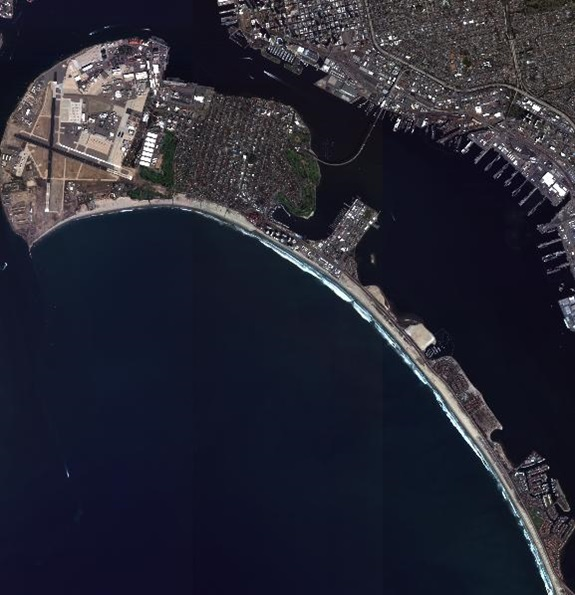
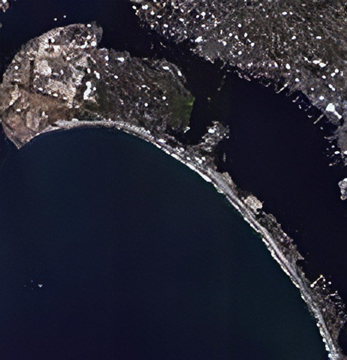
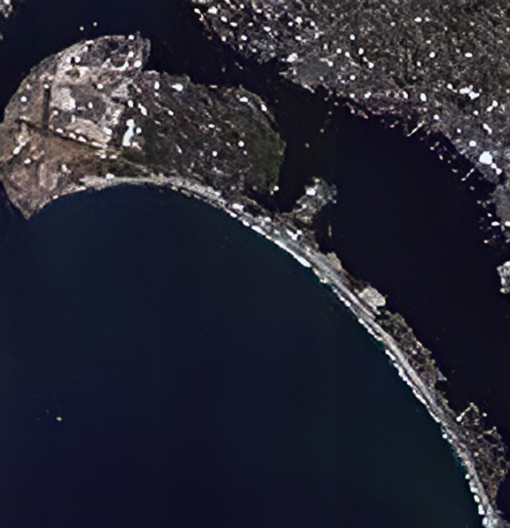
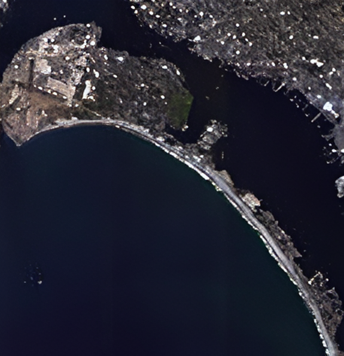
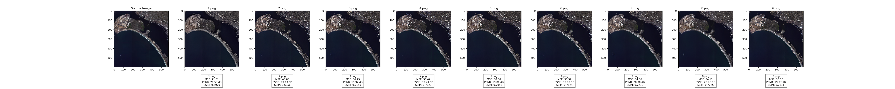

# Measuring Image Similarity

## Overview

`Image_Similarity_Measure` is a Python program that allows you to compare the similarity between a source image and a set of comparison images using various metrics, including Mean Squared Error (MSE), Peak Signal-to-Noise Ratio (PSNR), and Structural Similarity Index (SSIM).

## Features

- **MSE (Mean Squared Error):** Measures the average squared difference between corresponding pixels of the source and comparison images.

- **PSNR (Peak Signal-to-Noise Ratio):** Represents the ratio between the maximum possible power of an image and the power of corrupting noise.

- **SSIM (Structural Similarity Index):** Evaluates the structural similarity between the source and comparison images.

## Usage

1. **Installation:**
- Make sure you have the required dependencies installed. You can install them using the following:
     ```bash
     pip install opencv-python numpy scikit-image matplotlib
     ```

2. **Clone the Repository:**
   ```bash
   git clone https://github.com/topazlaz/Measuring_Image_Similarity.git
   cd Measuring_Image_Similarity
   ```

3. **Run:**
- Edit the example usage section in the `ISM.py` file according to your image paths.
  ```bash
  python ISM.py
  ```
4. **Result**
- The program will generate a comparison result image and display it, showcasing the source image and its comparisons with corresponding metrics. The result image will be saved in the `/Results` folder.
- Comparison Criteria:
  - The source image is located in the `/GT` directory.
  - Comparison images are stored in the `/Source` directory.
  - The resulting comparison image is saved in the `/Results` directory.

## Example

### Source Image
</img><br/>

### Comparison Images
1
</img>
2
</img>
3
</img>
4
</img>
5
</img>
6
</img><br/>
7
</img>
8
</img>
9
</img>

### Comparison Result
</img>

## License
All code and documentation in this project are available under the [MIT License](https://opensource.org/licenses/MIT).
See the [LICENSE file](./LICENSE) for details.
